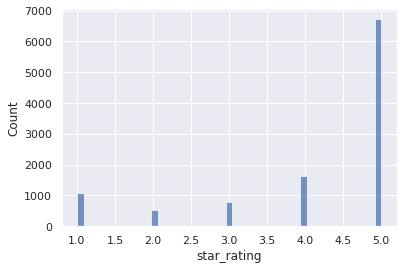
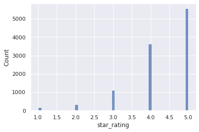
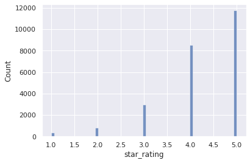
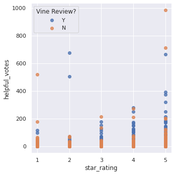
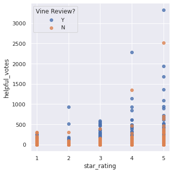

# big-data-challenge

### Robert Lane  
[LinkedIn](https://www.linkedin.com/in/robert-lane-jr/) [GitHub](https://github.com/RL-Lane)

## Overview

This project uses Google Colab to perform ETL (Extract, Transform, Load) operations in order to prepare very large public datasets for use in an AWS (Amazon Web Services) RDS (Relational Database Service) server.  The datasets used are *Home Improvement* and *Kitchen*, found in [this list](https://s3.amazonaws.com/amazon-reviews-pds/tsv/index.txt) of large datasets hosted at Amazon's S3 service.

The second part of this project seeks to analyze Amazon's Vine review program to detect any differences which could lead to bias in products.

## Results

As demonstrated in earlier group projects, ETL tasks are fairly straightforward provided that one is mindful of datatypes and the target schema.  This project includes code which makes key values not nullable, as directed by the provided [schema](Resources/schema.sql).

<figcaption><i>Histogram of home improvement reviews without Vine</i></figcaption>

<figcaption><i>Histogram of kitchen reviews without Vine</i></figcaption>

<figcaption><i>Histogram of home improvement reviews with Vine</i></figcaption>

<figcaption><i>Histogram of kitchen reviews with Vine</i></figcaption>

Within the Home Improvement reviews dataset, there doesn't seem to be a huge difference between the means of star ratings, helpful votes, or total votes on each review.  There is, however, a rather large difference between the maximum number of votes, which suggests that non-vine reviews may on average receive more views.  Coupled with the fact that non-vine reviews are over 100 times more common, this may indicate that customers are looking for reviews with less bias.

The Kitchen reviews dataset, in contrast to the Home Improvement dataset, shows a rather large difference between the number of helpful votes and the number of total votes, with no large difference on star rating.

The difference in reviews between these two datasets may indicate that there are different patterns to the ways in which buyers of kitchen goods and buyers of home improvement goods interact and interpret reviews.  It may also indicate that there is some difference in the way Vine is implemented.  It is worth noting here that although there isn't a huge difference between the standard error of star ratings on vine reviews and non-vine reviews, it *is* a detectably smaller range of scores when Vine is present.

<figcaption><i>Scatterplot of home improvement reviews, with vs. without Vine</i></figcaption>

<figcaption><i>Scatterplot of kitchen reviews, with vs. without Vine</i></figcaption>

Although vine reviews seem to rarely have a rating under 3 stars, they do seem to have more 3- and 4-star reviews than their non-Vine counterparts.

In a similar vein to the Kitchen Reviews dataset, non-Vine reviews seem to be more likely to assign either a 1-star or a 5-star review, whereas Vine reviews are slightly more evenly distributed.

Just like in the Kitchen dataset, Vine reviews tend to be rated as more helpful.

## Summary

There are some detectable differences in Vine reviews versus non-Vine reviews within these datasets.  In general, although Vine reviews seem to be fairly similar in scores to non-Vine reviews, but part of the difference between them seems to be that other customers rate Vine reviews as more helpful.  This may be because sellers seek out reviews on new products in order to entice sales, so the products used for Vine reviews are likely to be newer products that have relatively lower numbers of reviews.  In turn, future purchasers will tend to see older reviews first, since they have had more time to build up helpful votes from other buyers, therefore adding to the influence of Vine reviewers.